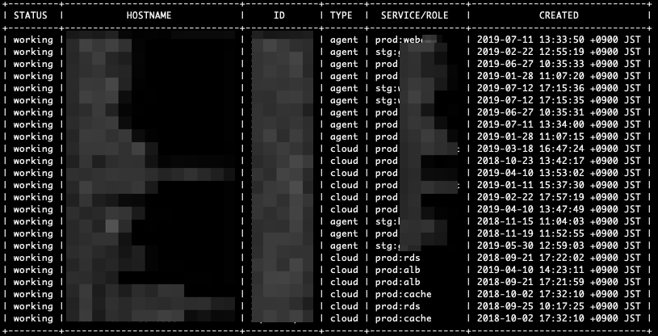
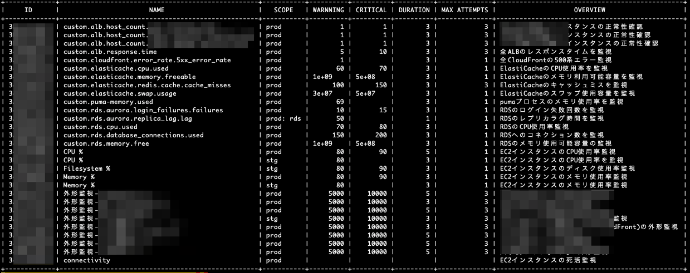
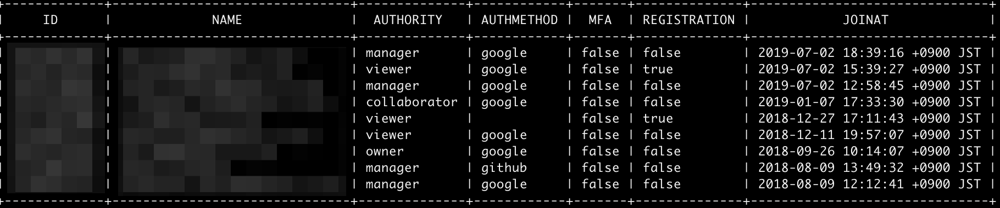

[][travis]

## はじめに

Mackerelで運用するときによく行う情報参照や操作をCLIで楽に行うために、結果をテーブル出力するツールを作りました。
ツール作成には`mackerel-client-go`を利用しています。

- mackerel-client-go
  - https://github.com/mackerelio/mackerel-client-go

## 初期設定 (ORGの設定)

環境変数にMackerelのAPI-KEYをセットする
- export MKRKEY_OrgA=<MACKERL_KEY>
- export MKRKEY_OrgB=<MACKERL_KEY>

```
mkrKeyOrgA = os.Getenv("MKRKEY_OrgA")
mkrKeyOrgB = os.Getenv("MKRKEY_OrgB")
```

今回は ORGを`orgA` と `orgB` としているので、以下のコードを実際のORG名に適宜変更しても使える

```
OrgA        = "orgA"
OrgB        = "orgB"
```


**コンパイル済みのコードは `./bin/` 配下に配置しています**

## 使い方(コマンドオプション)

### ホスト系
- Mackerel API ドキュメント
  - https://mackerel.io/ja/api-docs/entry/hosts

```
  ■ 一覧
    > $ ore-mkr -org=<ORG> -type=host

  ■ statusを変更する
    > $ ore-mkr -org=<ORG> -type=host -<STATUS> target=<HOSTID>
      ※) STATUS: working standby maintenance poweroff retire
```

[実行結果]



### 監視設定系
- Mackerel API ドキュメント
  - https://mackerel.io/ja/api-docs/entry/monitors

```
  ■ 一覧 
    > $ ore-mkr -org=<ORG> -type=monitor
```

[実行結果]



### ユーザ系
- Mackerel API ドキュメント
  - https://mackerel.io/ja/api-docs/entry/users
  - mackerel-client-goにAPI実装がなかったのでPR作成してMergeしてもらった
    - https://github.com/mackerelio/mackerel-client-go/pull/92
    - Blog: https://yhidetoshi.hatenablog.com/entry/2019/07/20/093148

``` 
  ■ 一覧 
    > $ ore-mkr -org=<ORG> -type=user
```

[実行結果]



### アラート系
- Mackerel API ドキュメント
  - https://mackerel.io/ja/api-docs/entry/alerts

```
  ■ 一覧
    > $ ore-mkr -org=<ORG> -type=alert
```
