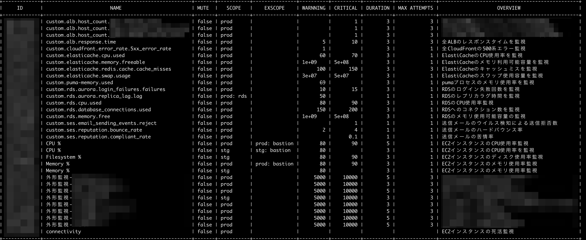

## 初期設定 (ORGの設定)

環境変数にMackerelのAPI-KEYをセットする
- export MKRKEY_OrgA=<MACKERL_KEY>
- export MKRKEY_OrgB=<MACKERL_KEY>

```
mkrKeyOrgA = os.Getenv("MKRKEY_OrgA")
mkrKeyOrgB = os.Getenv("MKRKEY_OrgB")
```

今回は ORGを`orgA` と `orgB` としているので、以下のコードを実際のORG名に適宜変更しても使える

```
OrgA        = "orgA"
OrgB        = "orgB"
```


**コンパイル済みのコードは `./bin/` 配下に配置しています**

## 使い方(コマンドオプション)

### host
```
  ■ 一覧
    > $ ore-mkr -org=<ORG> -type=host

  ■ statusを変更する
    > $ ore-mkr -org=<ORG> -type=host -<STATUS> target=<HOSTID>
      ※) STATUS: working standby maintenance poweroff retire
```

[実行結果]


### 監視設定
```
  ■ 一覧 
    > $ ore-mkr -org=<ORG> -type=monitor
```

[実行結果]



### アラート一覧
```
  ■ 一覧
    > $ ore-mkr -org=<ORG> -type=alert
```
